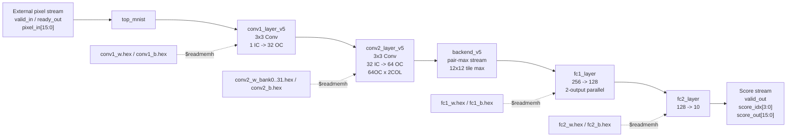

# FPGA Handwritten Digit Recognition

## 1. Project Overview

本项目实现了一个面向 MNIST 手写数字识别的 FPGA CNN 推理加速器。当前 RTL 目标器件为 Zynq-7020 `xc7z020clg400-1`，顶层模块为 `top_mnist`。

输入为 28x28 灰度图像的 signed 16-bit 定点像素流，输出为 10 个类别分数。当前 RTL 没有实现 AXI、DMA、UART 或板级外设驱动，`top_mnist` 暴露的是简化的流式像素输入接口和分数输出接口，便于仿真和后续接入外部数据搬运模块。

当前最新验证版本为：

```text
iter14_module_tb_verified
```

该版本的核心优化是 Conv2 `64OC x 2COL`：在同一个 3x4 activation tile 上，一次计算 64 个输出通道的两个相邻输出列，并在 Conv2 内部先完成 pair-max 压缩后再送入 backend。

## 2. Current Source Files

当前 Vivado 脚本实际使用的 RTL 文件位于 `fpga/src`。

| File | Module | Role |
|---|---|---|
| `top_mnist.sv` | `top_mnist` | 顶层模块，连接输入缓存、Conv1、Conv2、backend 和输出分数寄存器 |
| `conv1_layer_v5.sv` | `conv1_layer_v5` | 第一层 3x3 卷积，1 个输入通道，32 个输出通道 |
| `conv2_layer_v5.sv` | `conv2_layer_v5` | 第二层 3x3 卷积，当前核心计算模块，使用 64OC x 2COL tile 数据流 |
| `backend_v5.sv` | `backend_v5` | 接收 Conv2 pair-max stream，完成 12x12 tile max pooling，并调度 FC1/FC2 |
| `fc1_layer.sv` | `fc1_layer` | 全连接层 256 -> 128，当前版本每次并行计算 2 个输出神经元 |
| `fc2_layer.sv` | `fc2_layer` | 全连接层 128 -> 10 |
| `line_buffer.sv` | `line_buffer` | 行缓冲，将一维像素流转换为 3x3 sliding window |
| `weight_rom.sv` | `weight_rom` | 同步 ROM 模块，主要用于 FC2 权重读取 |

权重和测试数据位于 `fpga/data`。当前 README 只描述上述文件组成的最新 RTL 版本。

## 3. System Architecture



顶层接口：

| Signal | Direction | Width | Description |
|---|---|---:|---|
| `clk` | input | 1 | 单时钟域 |
| `rst_n` | input | 1 | 低有效异步复位 |
| `valid_in` | input | 1 | 输入像素有效 |
| `ready_out` | output | 1 | 顶层可接收输入 |
| `pixel_in` | input | signed 16 | 输入像素 |
| `valid_out` | output | 1 | 输出分数有效 |
| `score_idx` | output | 4 | 当前输出类别编号 |
| `score_out` | output | signed 16 | 当前类别分数 |

## 4. Neural Network Configuration

当前 RTL 对应的网络结构：

```text
Input 28x28x1
  -> Conv1: 3x3, 1 input channel, 32 output channels, ReLU
  -> Conv2: 3x3, 32 input channels, 64 output channels, ReLU
  -> Backend tile max: 24x24x64 -> 2x2x64 = 256 features
  -> FC1: 256 -> 128, ReLU
  -> FC2: 128 -> 10 scores
```

数据格式：

| Item | Format / Width | Notes |
|---|---|---|
| Pixel / activation | signed 16-bit | Python 导出时放大并裁剪到 signed 16-bit |
| Weight / bias | signed 16-bit | 由 hex 文件通过 `$readmemh` 初始化 |
| Conv / FC accumulator | signed 40-bit | Conv1、Conv2、FC1 使用 40-bit 累加 |
| Activation | ReLU + saturation | Conv1、Conv2、FC1 输出阶段执行 |
| Final score | signed 16-bit | FC2 输出 10 类分数 |

## 5. Hardware Design

| Module | Function | Input | Output | Hardware Resource / Design Role |
|---|---|---|---|---|
| `top_mnist` | 顶层连接和输出分数寄存 | 16-bit pixel stream | 10-class score stream | wrapper / glue logic |
| `line_buffer` | 一维流转 3x3 window | pixel stream | `pixel_out[0:8]` | local row buffer |
| `conv1_layer_v5` | Conv1 计算 | 3x3 input window | 32-channel stream | first convolution stage |
| `conv2_layer_v5` | Conv2 计算核心 | 32-channel packed stream | 64-channel pair-max stream | main compute engine, 64OC x 2COL |
| `backend_v5` | tile max pooling + FC 调度 | Conv2 pair-max stream | FC input features | pooling buffer and controller |
| `fc1_layer` | FC1 计算 | 256 features | 128 activations | two-output parallel MAC |
| `fc2_layer` | FC2 计算 | 128 activations | 10 scores | classifier output layer |
| `weight_rom` | 同步权重 ROM | address | weight data | ROM abstraction |

### Conv2 64OC x 2COL

当前版本最重要的硬件设计位于 `conv2_layer_v5.sv`。

Conv2 数学任务：

```text
out[oc, y, x] =
  bias[oc] +
  sum ic=0..31
  sum ky=0..2
  sum kx=0..2
    in[ic, y+ky, x+kx] * weight[oc, ic, ky, kx]
```

当前实现方式：

| Structure | RTL Signal | Description |
|---|---|---|
| 32-channel packed input | `lb_pixel_in[511:0]` | 32 个 Conv1 输出通道打包为一个 512-bit 向量 |
| 3x3 vector line buffer | `lb_out[0:8]` | 每个 window 元素都是 512-bit 向量 |
| 3x4 activation tile | `tile_r0[0:3]`, `tile_r1[0:3]`, `tile_r2[0:3]` | 两个相邻输出列共享的输入 tile |
| Two adjacent output columns | `px0_read`, `px1_read` | col0 使用 tile 列 0..2，col1 使用 tile 列 1..3 |
| Weight banks | `w_rom_0` .. `w_rom_31` | 每个 bank 存两个输出通道组：OC 0..31 和 OC 32..63 |
| Low/high weight reads | `w_read_lo[0:31]`, `w_read_hi[0:31]` | 每拍读取 64 个输出通道所需权重 |
| Local psum | `acc0[0:63]`, `acc1[0:63]` | 两个输出列、64 个输出通道的 partial sum |
| Result buffers | `results0[0:63]`, `results1[0:63]` | 保存两列卷积结果 |
| Pair-max output | `max2(results0[i], results1[i])` | Conv2 内部先合并相邻两列，再送 backend |

每个 3x4 tile 的核心计算周期：

```text
32 input channels x 3 x 3 kernel = 288 cycles
```

每个 tile 同时覆盖：

```text
64 output channels x 2 adjacent output columns
```

因此当前 Conv2 输出到 backend 的数据已经是 pair-max 后的 64-channel stream。

## 6. Data Path

当前数据路径：

```text
Input pixel[15:0]
  -> top_mnist input buffer
  -> Conv1 line_buffer
  -> Conv1 MAC and ReLU
  -> 32-channel Conv1 stream
  -> Conv2 512-bit vector line_buffer
  -> Conv2 3x4 activation tile
  -> Conv2 64OC x 2COL MAC
  -> Conv2 local pair-max
  -> backend_v5 12x12 tile max
  -> FC1 2-output parallel MAC
  -> FC2 classifier
  -> score_idx / score_out
```

Conv2 到 backend 的流格式：

```text
24 rows x 12 pair-columns x 64 channels
```

backend 中的 `pool2_max[0:255]` 保存最终 `2 x 2 x 64 = 256` 个特征。每个通道独立池化。

## 7. Control Logic

主要控制结构：

| Module | FSM / Control | Description |
|---|---|---|
| `conv1_layer_v5` | `IDLE`, `COMPUTE`, `SERIAL_OUT` | 等待 3x3 window，计算 32 个输出通道并串行输出 |
| `conv2_layer_v5` | `IDLE`, `WAIT_SECOND`, `COMPUTE`, `WAIT_PIPE` | 收集两个相邻 window，形成 3x4 tile，计算 64OC x 2COL |
| `backend_v5` | counters and flags | 使用 `ic_idx`、`col_idx`、`row_idx`、`pool_req`、`fc_inflight` 控制 pooling 和 FC 启动 |
| `fc1_layer` | `IDLE`, `RUN`, `STORE`, `FINISH` | 每次计算两个 FC1 输出神经元 |
| `fc2_layer` | `IDLE`, `RUN`, `STORE`, `FINISH` | 计算 10 个输出类别分数 |

模块间使用 valid / ready 风格握手。当前外部输入接口也是简化 valid / ready stream，不包含完整系统级外设协议。

## 8. Verification Results

以下数据来自本地 Vivado 2024.2 / xsim 最新验证结果。模块级仿真标签为 `module_tests_iter14`，top 级准确率仿真标签为 `iter14_module_tb_verified_100`，implementation 标签为 `iter14_module_tb_verified_impl`。

| Metric | Value | Source / Notes |
|---|---:|---|
| Module-level RTL tests | 7/7 pass | `tb_weight_rom`, `tb_line_buffer`, `tb_conv1_layer_v5`, `tb_conv2_layer_v5`, `tb_backend_v5`, `tb_fc1_layer`, `tb_fc2_layer` |
| RTL simulation images | 100 | `fpga/build/iter14_module_tb_verified_100/sim/accuracy.log` |
| RTL accuracy | 99/100, 99% | 100-image xsim run |
| Python golden match | 98/100, 98% | 100-image xsim run |
| Average cycles per image | 114,626 | 100-image xsim run |
| Target clock | 80 MHz | `fpga/scripts/timing.xdc` |
| Target period | 12.500 ns | Vivado post-route timing |
| 80 MHz latency per image | 1.4328 ms | `114,626 / 80 MHz` |
| 80 MHz throughput | 697.9 images/s | derived from cycle count |
| Full MNIST test-set accuracy | Not available in current files | 当前只保留 100-image RTL 仿真结果 |
| Board-level test result | Not available in current files | 当前仓库没有上板测试记录 |

100 张样本中，硬件输出对真实 label 的识别结果为 99/100。`golden_match=98/100` 表示其中有 2 张样本的 RTL argmax 与 Python golden argmax 不一致，但硬件对真实 label 的统计仍为 99/100。

## 9. FPGA Resource Utilization

以下数据来自 `iter14_module_tb_verified_impl` routed utilization report，器件为 `xc7z020clg400-1`。

| Resource | Used | Available | Utilization |
|---|---:|---:|---:|
| Slice LUTs | 26,648 | 53,200 | 50.09% |
| Slice Registers | 57,520 | 106,400 | 54.06% |
| Block RAM Tile | 8 | 140 | 5.71% |
| DSPs | 140 | 220 | 63.64% |
| Bonded IOB | 41 | 125 | 32.80% |
| BUFGCTRL | 2 | 32 | 6.25% |

当前设计仍能放入 Zynq-7020。资源压力主要来自 Conv2 的并行 MAC 和本地累加寄存器。DSP 占用已经达到 63.64%，继续增加 Conv2 并行度需要重新评估时序和布线压力。

## 10. Timing Analysis

以下数据来自 `iter14_module_tb_verified_impl` routed timing summary。

| Timing Metric | Value |
|---|---:|
| Target clock period | 12.500 ns |
| Target frequency | 80 MHz |
| WNS | +0.171 ns |
| TNS | 0.000 ns |
| WHS | +0.051 ns |
| THS | 0.000 ns |
| Timing closure | Met |

当前最差 setup path：

```text
Source:      conv2_inst/FSM_onehot_state_reg[2]/C
Destination: conv2_inst/acc1_reg[18][32]/D
Slack:       +0.171 ns
Data delay:  12.188 ns
Route delay: 11.546 ns, about 94.7%
```

这说明当前时序瓶颈主要不是 DSP 乘法本身，而是 Conv2 控制信号到大量累加寄存器的高扇出和布线延迟。

## 11. Reproduce

运行模块级 RTL testbench：

```powershell
powershell -ExecutionPolicy Bypass -File fpga\scripts\run_module_tests.ps1 -Tag module_tests_iter14
```

运行 100 张图 RTL 准确率仿真：

```powershell
powershell -ExecutionPolicy Bypass -File fpga\scripts\run_accuracy_sim.ps1 -Tag iter14_module_tb_verified_100 -NImages 100
```

重新生成 Vivado synthesis / implementation 报告：

```powershell
& "D:\Xilinx\Vivado\2024.2\bin\vivado.bat" -mode batch -source fpga\scripts\run_vivado_reports.tcl -tclargs iter14_module_tb_verified_impl
```

创建可手动打开的 Vivado 工程：

```powershell
& "D:\Xilinx\Vivado\2024.2\bin\vivado.bat" -mode batch -source fpga\scripts\create_project.tcl
```

生成的工程默认位于：

```text
fpga/build/manual_project/mnist_zynq_7020_rs.xpr
```

## 12. Notes

- 当前 README 只保留最新 `iter14_module_tb_verified` 版本内容。
- `fpga/build/` 被 `.gitignore` 排除，仿真和实现报告需要通过上述命令本地重新生成。
- 当前仓库没有完整 MNIST test-set RTL 仿真记录，也没有板级测试记录。
- 当前 RTL 顶层接口是简化像素流接口，不包含外部设备输入图像所需的 AXI/DMA/UART 模块。
