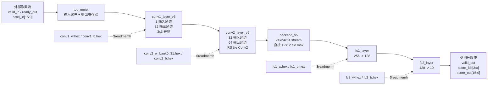

# FPGA 手写数字识别加速器

## 1. 项目概述

本项目在 Zynq-7020 FPGA 上实现了一个面向 MNIST 手写数字识别的 CNN 推理加速器。输入为 28x28 灰度数字图像，图像和模型参数在软件侧导出为 signed 16-bit 定点数据，RTL 通过流式接口接收像素并输出 10 个类别分数。

硬件顶层模块为 `top_mnist`。当前版本包含 Conv1、Conv2、流式 tile max pooling、FC1 和 FC2。设计重点是把 Conv2 做成适合 7020 资源约束的 row-stationary tile dataflow，并通过计算与输出重叠提高单张图片处理速度。

## 2. 当前仓库文件

当前 Vivado 工程真正使用的 RTL 文件位于 `fpga/src`：

| 文件 | 模块 | 作用 |
|---|---|---|
| `top_mnist.sv` | `top_mnist` | 顶层模块，连接输入缓冲、Conv1、Conv2、backend 和输出寄存器 |
| `conv1_layer_v5.sv` | `conv1_layer_v5` | 第一层 3x3 卷积 |
| `conv2_layer_v5.sv` | `conv2_layer_v5` | 第二层 3x3 卷积，当前 RS tile 数据流核心 |
| `backend_v5.sv` | `backend_v5` | Conv2 输出流的 tile max pooling 和 FC 调度 |
| `fc1_layer.sv` | `fc1_layer` | 全连接层 256 -> 128 |
| `fc2_layer.sv` | `fc2_layer` | 全连接层 128 -> 10 |
| `line_buffer.sv` | `line_buffer` | 3x3 滑窗行缓冲 |
| `weight_rom.sv` | `weight_rom` | 同步权重 ROM |

当前工程脚本不会使用其它 RTL 文件。旧的已跟踪 Vivado build 报告、过时 Tcl 脚本和未使用 testbench 已从本分支移除。

## 3. 系统架构



顶层接口：

| 信号 | 方向 | 位宽 | 说明 |
|---|---|---:|---|
| `clk` | input | 1 | 单时钟域 |
| `rst_n` | input | 1 | 低有效异步复位 |
| `valid_in` | input | 1 | 输入像素有效 |
| `ready_out` | output | 1 | 顶层可接收输入 |
| `pixel_in` | input | signed 16 | Q8.8 风格定点像素 |
| `valid_out` | output | 1 | 输出类别分数有效 |
| `score_idx` | output | 4 | 当前输出类别编号 |
| `score_out` | output | signed 16 | 当前类别分数 |

## 4. 神经网络和数据格式

当前 RTL 接收已经量化后的 signed 16-bit 数据。`py/export_fpga_data.py` 将 PyTorch 模型参数和 MNIST 图像乘以 256 后裁剪到 signed 16-bit 范围，因此 RTL 中可按 Q8.8 风格理解数据。

网络结构：

```text
Input 28x28x1
  -> Conv1: 3x3, 1 input channel, 32 output channels, ReLU
  -> Conv2: 3x3, 32 input channels, 64 output channels, ReLU
  -> Backend tile max: 24x24x64 -> 2x2x64 = 256 features
  -> FC1: 256 -> 128, ReLU
  -> FC2: 128 -> 10 scores
```

卷积和 FC 的 MAC 累加使用 signed 40-bit accumulator。Conv1、Conv2 和 FC1 在最终写回时做右移 8 位和 ReLU 饱和；FC2 输出 signed 16-bit 分数。

## 5. Row-Stationary Conv2 数据流

当前版本的重点是 `conv2_layer_v5`。Conv2 的计算任务是：

```text
out[oc, y, x] =
  bias[oc] +
  sum ic=0..31
  sum ky=0..2
  sum kx=0..2
    in[ic, y+ky, x+kx] * weight[oc, ic, ky, kx]
```

当前实现不是完整 Eyeriss PE mesh，而是针对本网络和 7020 资源约束裁剪后的 practical row-stationary tile engine。

Conv2 内部使用：

| 结构 | RTL 信号 | 说明 |
|---|---|---|
| 32 通道输入向量 | `lb_pixel_in[511:0]` | 每 32 个 Conv1 输出打包为一个 512-bit 向量 |
| 3x4 activation tile | `tile_r0[0:3]`, `tile_r1[0:3]`, `tile_r2[0:3]` | 三行、四列输入 tile 在本地寄存器中驻留 |
| 两个相邻输出列 | `px0_read`, `px1_read` | `col0` 使用 tile 列 0..2，`col1` 使用 tile 列 1..3 |
| 权重 bank | `w_rom_0` 到 `w_rom_31` | 32 个并行输出通道 bank |
| 局部 psum | `acc0[0:31]`, `acc1[0:31]` | 两个输出列的 partial sum 驻留在本地 accumulator |
| 输出结果缓存 | `results0[0:63]`, `results1[0:63]` | 两列、64 输出通道的结果缓存 |
| 输出重叠控制 | `out_active`, `serial_col`, `serial_oc` | 上一组 tile 输出时，下一组 tile 可继续计算 |

数据流可以概括为：

```text
Conv1 stream
  -> 32-channel vector pack
  -> 512-bit line_buffer
  -> 3 rows x 4 cols activation tile
  -> 32 output-channel weight banks
  -> local psum acc0 / acc1
  -> ReLU saturation
  -> row -> col -> channel serializer
  -> backend_v5
```

这个结构保留了 RS 讲解中最重要的三点：

- 输入行驻留：三行 activation tile 保存在本地寄存器中。
- 权重复用：同一拍读取的 32 个权重同时用于两个相邻输出列。
- psum 驻留：两个输出列的 partial sum 在 `acc0` / `acc1` 中累计到完整卷积结束。

## 6. 控制逻辑

模块间采用 valid / ready 风格的流式握手。

主要 FSM：

| 模块 | 状态 | 说明 |
|---|---|---|
| `conv1_layer_v5` | `IDLE`, `COMPUTE`, `SERIAL_OUT` | 等待 3x3 window，计算 32 个输出通道并串行输出 |
| `conv2_layer_v5` | `IDLE`, `WAIT_SECOND`, `COMPUTE`, `WAIT_PIPE` | 接收两个相邻 window 组成 3x4 tile，计算两列输出 |
| `fc1_layer` | `IDLE`, `RUN`, `STORE`, `FINISH` | 串行计算 128 个 FC1 神经元 |
| `fc2_layer` | `IDLE`, `RUN`, `STORE`, `FINISH` | 串行计算 10 个输出类别 |

`backend_v5` 不使用 enum FSM，而是通过 `ic_idx`、`col_idx`、`row_idx`、`pool_req`、`fc_inflight` 和 `finish_pending` 控制 Conv2 stream 的接收、tile max 更新和 FC 启动。

## 7. 性能结果

以下数据来自本地 Vivado 2024.2 / xsim 运行结果，最终标签为 `iter11_rs_overlap` 和 `iter11_rs_overlap_100`。`fpga/build/` 被 `.gitignore` 排除，克隆仓库后可通过 README 末尾命令重新生成报告。

| 指标 | 当前值 | 来源 / 说明 |
|---|---:|---|
| 目标时钟 | 80 MHz | `fpga/scripts/timing.xdc` |
| 目标周期 | 12.500 ns | `create_clock -period 12.500` |
| 平均周期 / image | 214,562 cycles | `iter11_rs_overlap_100` xsim summary |
| 80 MHz 下单张延迟 | 约 2.682 ms | 214,562 / 80 MHz |
| 80 MHz 下吞吐率 | 约 372.9 images/s | 顺序处理单张延迟推导 |
| 30 张 RTL 准确率 | 30/30, 100% | `iter11_rs_overlap` |
| 100 张 RTL 准确率 | 99/100, 99% | `iter11_rs_overlap_100` |
| 100 张 golden match | 98/100, 98% | `iter11_rs_overlap_100` |
| 完整 MNIST 测试集准确率 | Not available in current files | 当前仓库没有完整测试集 RTL 仿真日志 |
| 板级测试结果 | Not available in current files | 当前仓库没有上板测试记录 |
| Fmax 扫频 | Not available in current files | 当前只验证 80 MHz timing |

100 张样本中，idx 87 和 idx 92 与 golden argmax 不一致；硬件对真实 label 的识别结果为 99/100。

## 8. FPGA 资源利用率

以下数据来自 `iter11_rs_overlap` routed utilization report。

| Resource | Used | Available | Utilization |
|---|---:|---:|---:|
| Slice LUTs | 21,003 | 53,200 | 39.48% |
| Slice Registers | 54,572 | 106,400 | 51.29% |
| Slice | 13,254 | 13,300 | 99.65% |
| Block RAM Tile | 17 | 140 | 12.14% |
| DSPs | 75 | 220 | 34.09% |
| Bonded IOB | 41 | 125 | 32.80% |
| BUFGCTRL | 2 | 32 | 6.25% |

当前设计可以装入 xc7z020clg400-1，但 Slice 使用率已经接近满载。继续扩大 Conv2 并行度需要重新评估 placement 和 timing 风险。

## 9. 时序和功耗

以下数据来自 `iter11_rs_overlap` routed timing / power report。

| 项目 | 值 |
|---|---:|
| Target clock period | 12.500 ns |
| WNS | +0.524 ns |
| TNS | 0.000 ns |
| WHS | +0.050 ns |
| Timing closure | Met |
| Total on-chip power | 0.347 W |
| Dynamic power | 0.238 W |
| Device static power | 0.109 W |

当前关键 setup path 位于 Conv2 内部，从 `conv2_inst/px1_read_reg[2]` 到 `conv2_inst/results1_reg[13][3]`，data path delay 为 11.660 ns，包含 1 个 DSP48E1、4 级 CARRY4 和少量 LUT 逻辑。

## 10. 验证方式

当前保留的主要验证入口：

| 文件 | 作用 |
|---|---|
| `fpga/sim/tb_mnist_top_acc.sv` | 顶层准确率 testbench |
| `fpga/scripts/run_accuracy_sim.ps1` | 编译 RTL、生成配置后的 testbench、运行 xsim |
| `fpga/scripts/run_vivado_reports.tcl` | 创建 Vivado 工程并运行 synthesis / implementation report |
| `fpga/scripts/create_project.tcl` | 创建可手动打开的 Vivado 工程 |
| `py/export_fpga_data.py` | 从 PyTorch checkpoint 导出 FPGA hex 数据 |

运行 30 张准确率仿真：

```powershell
powershell -ExecutionPolicy Bypass -File fpga\scripts\run_accuracy_sim.ps1 -Tag iter11_rs_overlap -NImages 30
```

运行 100 张准确率仿真：

```powershell
powershell -ExecutionPolicy Bypass -File fpga\scripts\run_accuracy_sim.ps1 -Tag iter11_rs_overlap_100 -NImages 100
```

重新生成 Vivado 实现报告：

```powershell
& "D:\Xilinx\Vivado\2024.2\bin\vivado.bat" -mode batch -source fpga\scripts\run_vivado_reports.tcl -tclargs iter11_rs_overlap
```

创建可手动打开的 Vivado 工程：

```powershell
& "D:\Xilinx\Vivado\2024.2\bin\vivado.bat" -mode batch -source fpga\scripts\create_project.tcl
```

生成的工程默认位于：

```text
fpga/build/manual_project/mnist_zynq_7020_rs.xpr
```

## 10.1 Latest verified snapshot

The current verified RTL snapshot is `iter12_pairmax_fc1x2`.

| Metric | Value | Source / Notes |
|---|---:|---|
| RTL simulation images | 100 | `fpga/build/iter12_pairmax_fc1x2_100/sim/accuracy.log` |
| RTL accuracy | 99/100, 99% | 100-image xsim run |
| Python golden match | 98/100, 98% | 100-image xsim run |
| Average cycles per image | 197,858 | 100-image xsim run |
| Target clock | 80 MHz | `fpga/scripts/timing.xdc` |
| Target period | 12.500 ns | Vivado post-route timing |
| Post-route WNS | +0.285 ns | `route_timing_summary.rpt` |
| Post-route TNS | 0.000 ns | `route_timing_summary.rpt` |
| Timing closure | Met | Vivado post-route timing |
| Slice LUTs | 21,246 / 53,200, 39.94% | `route_utilization.rpt` |
| Slice Registers | 54,620 / 106,400, 51.33% | `route_utilization.rpt` |
| BRAM Tile | 8 / 140, 5.71% | `route_utilization.rpt` |
| DSPs | 76 / 220, 34.55% | `route_utilization.rpt` |

This snapshot includes Conv2 local pair-max compression and two-output parallel FC1 computation. The next optimization target is Conv2 `64OC x 2COL`.

## 11. 说明

本分支保留当前版本实际使用的 RTL、脚本、仿真入口和 100 张验证样本数据。Vivado build 目录、旧实现报告、IDE 配置和过时脚本不再作为源码仓库内容维护。当前 RTL 中没有额外未使用的 `fpga/src/*.sv` 文件可删除。
