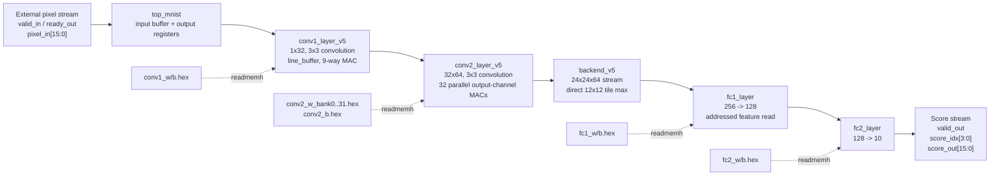

# FPGA Handwritten Digit Recognition

## 1. Project Overview

This project implements an FPGA-based handwritten digit recognition accelerator for MNIST-style 28x28 grayscale digit images. The RTL top level accepts one signed 16-bit pixel stream, processes the image through two convolution stages, a tile-max pooling backend, and two fully connected layers, then emits ten signed 16-bit class scores with a 4-bit score index.

The hardware design moves the convolution, pooling, accumulation, activation, and classification datapath into FPGA logic. Compared with a pure software implementation, the hardware accelerator exposes a streaming input/output interface and maps repeated multiply-accumulate operations onto FPGA DSP, LUT, register, and BRAM resources.

## 2. System Architecture

- FPGA top module: `fpga/src/top_mnist.sv`, module name `top_mnist`.
- Input interface: `valid_in`, `ready_out`, and signed `pixel_in[15:0]`.
- Data preprocessing: image normalization and Q8.8 quantization are performed by `py/export_fpga_data.py`; the RTL receives already-quantized 16-bit pixels.
- Neural network / classifier modules: `conv1_layer_v5`, `conv2_layer_v5`, `backend_v5`, `fc1_layer`, and `fc2_layer`.
- Storage modules: line-buffer arrays, initialized weight/bias ROM arrays loaded by `$readmemh`, `weight_rom`, and the backend `pool2_max[0:255]` buffer.
- Control modules: handshake logic in `top_mnist`, line-buffer valid/ready flow control, and FSMs in convolution and fully connected layers.
- Output interface: `valid_out`, `score_idx[3:0]`, and signed `score_out[15:0]`.
- Clock and reset: single `clk` domain and active-low asynchronous reset `rst_n`.



## 3. Hardware Design

`top_mnist` connects the streaming input to Conv1, Conv2, the backend pooling/classifier block, and the output score stream. It contains a one-entry input buffer and IOB-registered output signals.

The datapath uses `DATA_WIDTH = 16`. `py/export_fpga_data.py` converts floating-point model values to signed Q8.8-style integers by multiplying by 256 and clipping to the signed 16-bit range. The RTL MAC stages accumulate into signed 40-bit registers and shift right by 8 before saturation. Conv1, Conv2, and FC1 use ReLU-style non-negative saturation; FC2 saturates to signed 16-bit output scores.

Weights and biases are stored in hex files under `fpga/data`. Conv1 loads `conv1_w.hex` and `conv1_b.hex`. Conv2 loads `conv2_b.hex` plus 32 independent weight-bank files, `conv2_w_bank0.hex` through `conv2_w_bank31.hex`. FC1 and FC2 use `weight_rom` instances for weight storage and distributed bias memories.

Intermediate results are not stored as a complete full-frame feature map after Conv2. `backend_v5` consumes the Conv2 output stream and updates `pool2_max[0:255]`, representing 2x2 spatial tiles across 64 channels. This implements a direct max over each 12x12 quadrant of the 24x24 Conv2 output.

The implementation uses Vivado-inferred DSP48E1, LUT, register, and RAMB36E1 resources. The routed utilization report for the latest local implementation reports 43 DSP48E1 and 17 RAMB36E1 instances.

| Module | Function | Input | Output | Hardware Resource / Design Role |
|---|---|---|---|---|
| `top_mnist` | Top-level stream wrapper and module interconnect | `clk`, `rst_n`, `valid_in`, `pixel_in[15:0]` | `ready_out`, `valid_out`, `score_idx[3:0]`, `score_out[15:0]` | One-entry input buffer, output IOB registers, valid/ready wiring |
| `line_buffer` | 3x3 sliding-window generator | Signed pixel stream, parameterized width | `pixel_out[0:8]`, `valid_out` | Register/distributed storage for two prior rows and window taps |
| `conv1_layer_v5` | First 3x3 convolution, 1 input channel, 32 output channels | 28x28 signed 16-bit pixel stream | Serialized 26x26x32 feature stream | 9 product registers, staged reduction, 40-bit accumulation, ReLU saturation |
| `conv2_layer_v5` | Second 3x3 convolution, 32 input channels, 64 output channels | Serialized Conv1 stream | Serialized 24x24x64 feature stream | 32 parallel output-channel MAC lanes, 32 initialized weight ROM banks |
| `backend_v5` | Streamed tile max plus FC classifier wrapper | Conv2 feature stream | Ten serialized class scores | `pool2_max[256]`, tile-address logic, FC1/FC2 coordination |
| `fc1_layer` | Fully connected layer 256 -> 128 | Addressed `feature_data[15:0]` from backend | `out_pixels[0:127]` | Serial MAC over 256 features per neuron, BRAM-backed `weight_rom`, 40-bit accumulator |
| `fc2_layer` | Fully connected layer 128 -> 10 | `pixel_in[0:127]` | `out_pixels[0:9]` | Serial MAC over 128 inputs per class, BRAM-backed `weight_rom`, signed saturation |
| `weight_rom` | Generic initialized synchronous ROM | `addr` | signed `data_out[15:0]` | `(* ram_style = "block" *)`, two-stage BRAM read pipeline |

## 4. Data Path

Input Data -> Preprocessing -> Feature / MAC Computation -> Accumulation -> Classification -> Output Result

1. `py/export_fpga_data.py` exports MNIST test images into `fpga/data/image_*.hex` as signed 16-bit Q8.8-style pixel values.
2. The external source drives `pixel_in[15:0]` with `valid_in`; `top_mnist` accepts pixels when `ready_out` is high.
3. `conv1_layer_v5` uses `line_buffer #(DATA_WIDTH=16, IMG_WIDTH=28)` to generate 3x3 windows, multiplies the nine taps by Conv1 weights, accumulates with bias, applies ReLU saturation, and serializes 32 output-channel values per spatial position.
4. `conv2_layer_v5` groups 32 Conv1 channel values into a 512-bit line-buffer input, generates 3x3 windows over the 26x26 Conv1 feature map, and computes 64 output channels in two batches of 32 parallel MAC lanes.
5. `backend_v5` receives the 24x24x64 Conv2 stream. It maps each value to a tile address `{tile_r, tile_c, ic_idx}` and updates `pool2_max[0:255]`.
6. `fc1_layer` reads the 256 pooled features using `feature_addr` and `feature_data`, computes 128 ReLU outputs, and passes them as an array to FC2.
7. `fc2_layer` computes ten signed class scores.
8. `backend_v5` serializes the ten scores using `score_idx[3:0]` and `score_out[15:0]`; `top_mnist` registers them to `valid_out`, `score_idx`, and `score_out`.

Key visible RTL signals include:

| Signal | Width | Module | Role |
|---|---:|---|---|
| `pixel_in` | 16 signed | `top_mnist`, Conv layers, backend | Input pixel or serialized feature value |
| `valid_in` / `ready_out` | 1 | Streaming modules | Handshake for input acceptance |
| `valid_out` / `ready_in` | 1 | Conv layers | Handshake for downstream transfer |
| `p_c1_serial` | 16 signed | `top_mnist` | Conv1-to-Conv2 serialized feature stream |
| `p_c2_serial` | 16 signed | `top_mnist` | Conv2-to-backend serialized feature stream |
| `pool2_max` | 256 x 16 signed | `backend_v5` | 2x2x64 pooled feature buffer |
| `feature_addr` | 8 | `fc1_layer` / `backend_v5` | FC1 feature read address |
| `score_idx` | 4 | `top_mnist` / `backend_v5` | Output class score index |
| `score_out` | 16 signed | `top_mnist` / `backend_v5` | Output class score value |

## 5. Control Logic

The design uses valid/ready handshakes between streaming stages. `top_mnist` registers external input readiness through `ready_out_q` and uses `in_buf_valid` / `in_buf_pixel` as a one-entry input buffer before Conv1.

FSM states found in the RTL:

| Module | FSM States | Start Condition | End Condition |
|---|---|---|---|
| `conv1_layer_v5` | `IDLE`, `COMPUTE`, `SERIAL_OUT` | `lb_valid` from Conv1 line buffer | All 32 output-channel values serialized |
| `conv2_layer_v5` | `IDLE`, `COMPUTE`, `WAIT_PIPE`, `SERIAL_OUT` | `lb_valid` from Conv2 line buffer | All 64 output-channel values serialized |
| `fc1_layer` | `IDLE`, `RUN`, `STORE`, `FINISH` | `valid_in` from backend tile-max stage | All 128 FC1 outputs stored, then `valid_out` asserted |
| `fc2_layer` | `IDLE`, `RUN`, `STORE`, `FINISH` | `valid_in` from FC1 | All ten FC2 outputs stored, then `valid_out` asserted |

`backend_v5` uses counters and control flags rather than an explicit enum. Its visible control registers include `ic_idx`, `col_idx`, `row_idx`, `ready_out_reg`, `fc_inflight`, `finish_pending`, `pool_req`, `pool_addr`, and `pool_init`. When the last Conv2 value of the 24x24x64 stream is accepted, the backend stalls upstream input, launches FC1/FC2, emits ten scores, and then releases the stall.

## 6. Performance

The following data is extracted from the latest local build directory `fpga/build/iter5_conv1_pipe` and its associated reports/logs.

| Metric | Value | Source / Notes |
|---|---|---|
| Target clock frequency | 80.000 MHz | `fpga/scripts/timing.xdc`; `route_timing_summary.rpt` Clock Summary |
| Target clock period | 12.500 ns | `fpga/scripts/timing.xdc` |
| Maximum proven frequency | Not available in current files | Current timing reports validate the 80 MHz constraint but do not sweep Fmax |
| Latency per inference | 429,706 cycles average | `fpga/build/iter5_conv1_pipe/sim/accuracy.log`, `ACCURACY_SUMMARY` |
| Latency per inference at 80 MHz | About 5.371 ms | Derived from 429,706 cycles / 80 MHz |
| Throughput at 80 MHz | About 186.2 images/s | Derived from sequential latency; no overlapping multi-image throughput report is present |
| RTL simulation accuracy | 30/30 images, 100% | `accuracy.log`, exported 30-image test set |
| Golden prediction accuracy | 30/30 images, 100% | `accuracy.log`, same 30-image set |
| Hardware/golden argmax match | 30/30 images, 100% | `accuracy.log` |
| Full MNIST test accuracy | Not available in current files | No committed log with full test-set accuracy was found |
| Routed LUT utilization | 19,289 / 53,200, 36.26% | `route_utilization.rpt` |
| Routed FF utilization | 46,100 / 106,400, 43.33% | `route_utilization.rpt` |
| Routed BRAM utilization | 17 / 140, 12.14% | `route_utilization.rpt` |
| Routed DSP utilization | 43 / 220, 19.55% | `route_utilization.rpt` |
| Timing slack | WNS 0.419 ns, TNS 0.000 ns | `route_timing_summary.rpt` |
| Hold slack | WHS 0.054 ns, THS 0.000 ns | `route_timing_summary.rpt` |
| Power | Total on-chip 0.322 W; dynamic 0.214 W; static 0.109 W | `top_mnist_power_routed.rpt` |
| Board-level performance | Not available in current files | No hardware board test log was found |

To regenerate implementation reports with Vivado:

```powershell
vivado -mode batch -source fpga/scripts/run_vivado_reports.tcl -tclargs <tag>
```

To rerun the 30-image RTL accuracy simulation:

```powershell
powershell -ExecutionPolicy Bypass -File fpga/scripts/run_accuracy_sim.ps1 -Tag <tag>
```

## 7. FPGA Resource Utilization

The routed utilization data below is from `fpga/build/iter5_conv1_pipe/reports/route_utilization.rpt`.

| Resource | Used | Available | Utilization |
|---|---:|---:|---:|
| Slice LUTs | 19,289 | 53,200 | 36.26% |
| Slice Registers | 46,100 | 106,400 | 43.33% |
| Block RAM Tile | 17 | 140 | 12.14% |
| DSPs | 43 | 220 | 19.55% |
| Bonded IOB | 41 | 125 | 32.80% |
| BUFGCTRL | 2 | 32 | 6.25% |

Primitive-level entries in the same report include 43 `DSP48E1`, 17 `RAMB36E1`, 42,017 `FDCE`, 4,096 `FDRE`, and 2 `BUFG` instances.

Per-module utilization is Not available in current files. The current report was generated with flat `report_utilization`; a module-level breakdown can be generated by running Vivado with `report_utilization -hierarchical` after synthesis or implementation.

## 8. Timing Analysis

Timing data is from `fpga/build/iter5_conv1_pipe/reports/route_timing_summary.rpt` and `fpga/build/iter5_conv1_pipe/reports/route_timing_paths.rpt`.

| Timing Item | Value | Source / Notes |
|---|---|---|
| Target clock period | 12.500 ns | `timing.xdc` and routed timing summary |
| Target clock frequency | 80.000 MHz | Routed timing summary Clock Summary |
| Worst Negative Slack | 0.419 ns | Reported as Slack (MET), setup path |
| Total Negative Slack | 0.000 ns | Routed timing summary |
| Worst Hold Slack | 0.054 ns | Routed timing summary |
| Timing closure | Met | `All user specified timing constraints are met.` |
| Critical setup path | `backend_inst/fc1_inst/px_d2_reg[15]` to `backend_inst/fc1_inst/out_pixels_reg[100][4]` | `route_timing_paths.rpt` |
| Data path delay | 11.826 ns | Critical path report |
| Maximum Fmax | Not available in current files | No Fmax sweep or unconstrained max-frequency report was found |

The reported critical setup path is inside FC1 saturation/output storage logic and includes one `DSP48E1`, four `CARRY4` levels, and small LUT logic.

## 9. Verification

Verification files found in the project:

| File | Purpose |
|---|---|
| `fpga/sim/tb_mnist_top_acc.sv` | Top-level 30-image RTL accuracy testbench |
| `fpga/sim/tb_mnist_top.sv` | Existing top-level simulation testbench |
| `fpga/sim/tb_conv1.sv` | Conv1 simulation testbench |
| `fpga/sim/tb_conv2.sv` | Conv2 simulation testbench |
| `fpga/sim/tb_backend.sv` | Backend simulation testbench |
| `fpga/data/image_0.hex` through `image_29.hex` | Exported 30-image input dataset |
| `fpga/data/labels_30.hex` | Labels for the 30-image simulation set |
| `fpga/data/golden_0.hex` through `golden_29.hex` | Golden FC2 score vectors for the 30 exported images |
| `fpga/scripts/run_accuracy_sim.ps1` | Runs `xvlog`, `xelab`, and `xsim` for the accuracy testbench |
| `fpga/scripts/run_vivado_reports.tcl` | Creates a Vivado project and emits synthesis/implementation reports |

The latest local simulation result is in `fpga/build/iter5_conv1_pipe/sim/accuracy.log`. It reports 30 images tested, 30 correct hardware predictions, 30 correct golden predictions, 30 hardware/golden argmax matches, and 429,706 average cycles per image.

Simulation waveform availability is Not available in current files committed for source review. A local generated WDB exists under the Vivado build directory, but generated waveform databases are not part of the source RTL flow.

Hardware board test results are Not available in current files.
